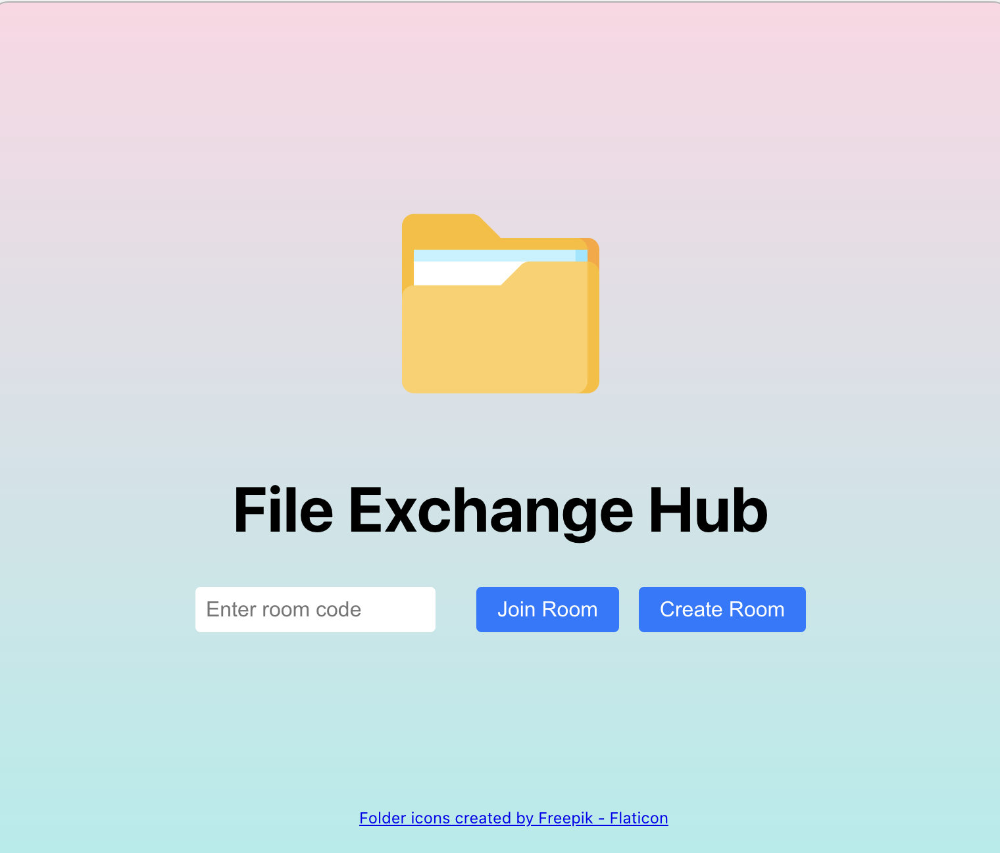
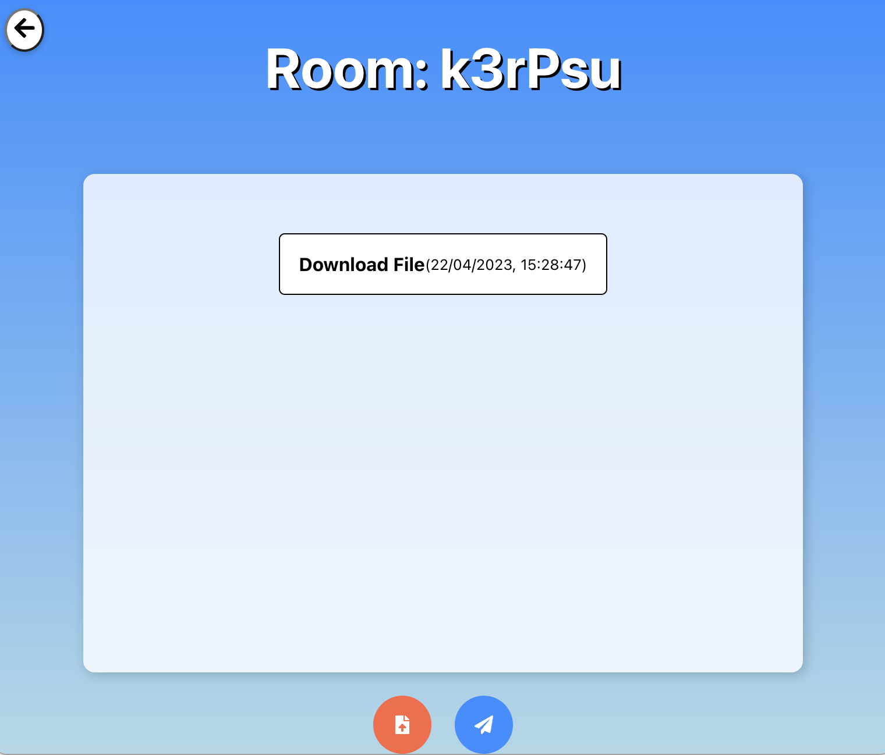

# File Exchange Hub

A powerful and user-friendly platform for exchanging files across different services with seamless integration. This project includes an Express server, a Socket.IO server, a file gateway, and a client, creating an efficient and secure way for users to transfer files between various services.

<p align="center">
  
  
</p>

## Table of Contents

- [File Exchange Hub](#file-exchange-hub)
  - [Table of Contents](#table-of-contents)
  - [Features](#features)
  - [Getting Started](#getting-started)
    - [Prerequisites](#prerequisites)
    - [Installation](#installation)
  - [Usage](#usage)
  - [Deployment](#deployment)
    - [Terraform](#terraform)
    - [Docker](#docker)
    - [GitHub Actions](#github-actions)
  - [License](#license)

## Features

- Seamless file exchange between various services
- Scalable architecture for future enhancements and integrations
- User-friendly interface for easy navigation and file management
- Secure and efficient data transfer using modern technologies

## Getting Started

These instructions will get you a copy of the project up and running on your local machine for development and testing purposes.

### Prerequisites

- [Node.js](https://nodejs.org/) (v14 or later)
- [Docker](https://www.docker.com/)
- [Google Cloud SDK](https://cloud.google.com/sdk/docs/install)
- [Terraform](https://www.terraform.io/downloads.html)

### Installation

1. Clone the repository:

```
git clone https://github.com/rafaelxokito/fileexchangehub.git
cd fileexchangehub
```

2. Install the dependencies for each service:

```
cd client && npm install
cd ../server && npm install
cd ../socket-server && npm install
cd ../file-gateway && npm install
cd ..
```

3. Create the uploads directory in the `server`, and `file-gateway` service directories.

```
cd server && mkdir uploads
cd ../file-gateway && mkdir uploads
cd ..
```

## Usage

1. Start the services:

```
cd client && npm start
cd ../server && npm start
cd ../socket-server && npm start
cd ../file-gateway && npm start
cd ..
```

2. Access the client at `http://localhost:8080`.

## Deployment

This project uses GitHub Actions, Terraform, and Docker to deploy to Google Cloud Run. 

### Terraform

Terraform is used to manage the infrastructure and provision resources for the project. Configuration files can be found in the modules directory for both production and development environments. It's the user's responsibility to ensure that all required variables are set correctly. The production environment is divided into five modules: "production_db" which sets up the service from MongoDB Atlas; "production_client" which sets up the client-side resources; "production_server" which sets up the server-side resources; "production_socket_server" which sets up the socket server resources; and "production_gateway" which sets up the gateway resources. Each of these modules is responsible for setting up the necessary services and domain content for their respective parts of the application to work.

To deploy the development module without having the Google Authentication credentials you should remove the terraform backend in the `main.tf` file on the root directory. Heres the code you should remove:

```
terraform {
    backend "gcs" {
        bucket = "fileexchangehub-terraform"
        prefix  = "terraform/state"
        credentials = "./auth.json"
    }
}
```

If you want to target a specific module, use the -target=module.{production_client/production_server/production_socket_server/production_gateway/production_db/development} flag with your Terraform commands.

To use Terraform for deploying the infrastructure, follow these steps:

1. Initialize Terraform:

```
terraform init
```

2. Validate the Terraform configuration files:

```
terraform validate
```

Review the execution plan, targeting a specific module (production_client, production_server, production_socket_server, production_gateway, production_db, development):

```
terraform plan -target=module.{production_client/production_server/production_socket_server/production_gateway/production_db/development}
```

4. Apply the changes to the infrastructure, targeting a specific module:

```
terraform apply -target=module.{production_client/production_server/production_socket_server/production_gateway/production_db/development}
```

5. (Optional) Destroy the infrastructure, targeting a specific module:

```
terraform destroy -target=module.{production_client/production_server/production_socket_server/production_gateway/production_db/development}
```

### Docker

Docker is used to containerize the services for easy deployment and management. Each service has its own `Dockerfile` for building images, and the `docker-compose.yml` file is used to manage containers in the development environment.

To start the containers using Docker Compose, run:

```
docker-compose up
```

To stop the containers, use:

```
docker-compose down
```

### GitHub Actions

GitHub Actions automates the build and deployment process. The workflow file `.github/workflows/deploy.yml` contains the configuration for building, testing

## License

This project is licensed under the MIT License - see the [LICENSE.md](LICENSE.md) file for details.